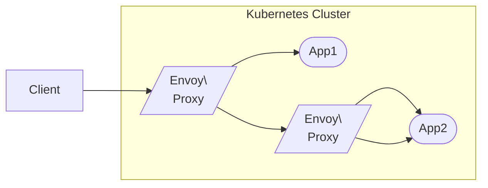
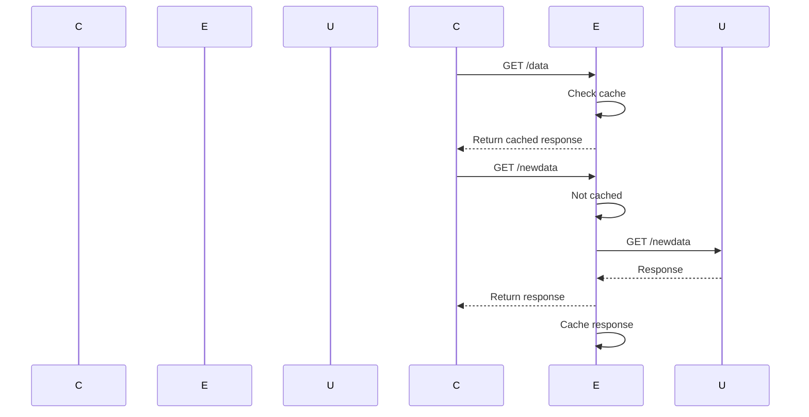

# Envoy as a Caching Proxy on Kubernetes
#### by sdarioz

Envoy is a popular open source edge and service proxy developed by Lyft.

It can act as a caching proxy to efficiently invalidate stale content. 

#### This guide will cover:

- Envoy architecture and caching overview
- Deploying Envoy on Kubernetes
- Configuration for caching and cache invalidation
- Integrating monitoring with Prometheus and Grafana
- Logging with Elasticsearch and Kibana
- Tracing with Jaeger

## Envoy Architecture

Envoy typically runs as a sidecar container alongside each service instance.



It intercepts incoming and outgoing traffic, providing:

- Service discovery
- Load balancing
- Observability
- Security
- Caching

## Envoy Caching

Envoy caching sits between the client and origin.

<br/>



The cache can be invalidated via purging specific URLs.

## Deploying Envoy on Kubernetes

We can deploy Envoy using a DaemonSet to run a proxy beside each pod:

```yaml
# envoy-daemonset.yaml

apiVersion: apps/v1
kind: DaemonSet  
metadata:
  name: envoy
spec:
  selector:
    matchLabels:
      app: envoy
  template:
    metadata:
      labels:
        app: envoy
    spec:
      containers:
      - name: envoy
        image: envoyproxy/envoy:latest
        ports:
        - containerPort: 80
        - containerPort: 443 
```

Service and endpoint definitions are needed to expose Envoy.

## Envoy Cache Configuration

Envoy's caching is configured in YAML/JSON config files.

Key settings include:

- **cache_size**: Total cache size e.g. 50MB
- **typed_config**: Cache behavior per resource type
- **ttl**: Time-to-live for cached responses

For example:

```yaml
resource_type:
  name: default
  config:
    ttl: 300s # 5 minutes
    cache_size: 50MB
```

## Cache Invalidation

To invalidate cached data, Envoy provides a **Purge API**.

For example, a POST to `/purge?hostname=example.com&path=/data/1` will purge that URL from the cache.

The app backend could trigger purges when data is changed.

## Monitoring with Prometheus

Envoy can export metrics in Prometheus format. We can scrape these metrics:

```yaml
scrape_configs:
  - job_name: 'envoy'
    scrape_interval: 5s
    static_configs:
    - targets: ['envoy-svc:9901']
```

And visualize metrics like cache hit rate, latency, errors etc in Grafana.

## Logging with Elasticsearch and Kibana

Envoy can send access logs to Elasticsearch via the `tcp` output.

```yaml
access_log:
  name: envoy.access_loggers.http_grpc
  typed_config:
    "@type": type.googleapis.com/envoy.extensions.access_loggers.grpc.v3.TcpGrpcAccessLogConfig
    common_config:
      log_name: egress_accesslog
      grpc_service:
        envoy_grpc:
          cluster_name: elasticsearch
```

Logs contain request/response details. Kibana can analyze access patterns.

## Distributed Tracing with Jaeger

Envoy supports distributed tracing via Jaeger.

Instrument services to propagate trace headers. Envoy automatically collects tracing data between services which is sent to the Jaeger collector.

This provides end-to-end visibility into request flows across Envoy proxies.

## Summary

- Envoy provides powerful edge proxy and caching capabilities
- Running Envoy as a Kubernetes sidecar enables advanced traffic management
- Prometheus, Jaeger, and Elastic provide monitoring, logging, and tracing
- Cache invalidation keeps things fast while ensuring freshness

Envoy helps build robust, observable applications on Kubernetes.

## Next: Integrated Caching with Varnish and Envoy