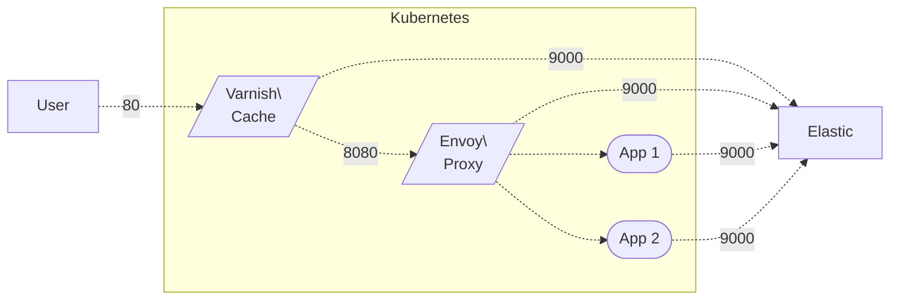

#### [Part 2] 
Basic overview for Varnish and Envoy on Kubernetes, monitored by the Elastic stack on Elastic Cloud implementation:

# Integrated Caching with Varnish and Envoy

#### by sdarioz

In many cases, using both Varnish and Envoy together can provide complementary caching and edge proxy capabilities for applications on Kubernetes.

This guide will walk through a detailed case study for deploying them integrated in a robust caching layer.

## Example Topology

We will deploy the following topology on Kubernetes:



- Varnish provides the public cache on port 80
- Envoy acts as internal proxy and cache
- Apps instrumented to ship logs to Elastic Cloud

## Deploying Varnish

We will use the `emgag/varnish` image from DockerHub:

```
apiVersion: apps/v1
kind: Deployment
metadata:
  name: varnish
spec:
  selector:
    matchLabels:
      app: varnish
  template:
    metadata:
      labels:
        app: varnish
    spec:
      containers:
      - name: varnish
        image: emgag/varnish:7.2.1-1
        ports:
        - containerPort: 80
---
apiVersion: v1
kind: Service
...
```

Configure routes to send traffic to Varnish.

## Deploying Envoy

Use a DaemonSet to run Envoy on each node:

```yaml 
apiVersion: apps/v1
kind: DaemonSet
...
spec:
  template:
    spec:
      containers:
      - name: envoy
        image: envoyproxy/envoy:v1.24.0
        ports:
          - containerPort: 8080
...
```

Envoy will cache responses and proxy requests to the backend apps.

## App Configuration

The apps need to:

- Set `PROXY_PASS` to the Envoy URL
- Allow caching of cacheable responses

For example:

```
# app.conf

proxy_pass: http://envoy.default.svc.cluster.local:8080
response_cache_control: public, max-age=3600
```

## Elastic Cloud Deployment

Deploy Elasticsearch, Kibana, and Logstash managed on Elastic Cloud.

Provide the Logstash endpoint to ship logs to.

## Log Collection

On Varnish and Envoy, collect access logs.

In the apps, use a logging library to capture logs and pipe to Logstash.

Logs will be centralized in Elasticsearch for analysis.

## Tracing

Enable distributed tracing by instrumenting apps and configuring Envoy to propagate headers.

Send traces to Jaeger. Integrate with Elastic APM for further analytics.

## Monitoring

Configure Prometheus to scrape metrics exposed by Varnish, Envoy, and the apps.

Visualize metrics in Grafana dashboards tailored to each component.

Set alerts on metrics like latency, errors, cache hit rate etc.

## Conclusion

This stack provides a robust caching architecture by combining:

- Varnish for efficient public edge caching
- Envoy for internal proxying and cache coordination
- Elastic for centralized logging and tracing
- Prometheus and Grafana for metrics monitoring

Together they can speed up and stabilize application delivery on Kubernetes.

## Next: Implementing Varnish on Kubernetes with monitoring via the Elastic stack