### [6] Implementing Varnish on Kubernetes with monitoring via the Elastic stack

# Varnish on Kubernetes with Elastic Observability
#### by sdarioz

In this guide, we will deploy Varnish on Kubernetes and integrate monitoring via the Elastic stack.

## Varnish Overview

Varnish provides an HTTP caching proxy. Benefits:

- Caches responses to improve speed
- Reduces load on backend servers
- Handles traffic spikes gracefully

We will run Varnish on Kubernetes to cache an application.

## Kubernetes Deployment

Use the `emgag/varnish` image from DockerHub:

```yaml
apiVersion: apps/v1
kind: Deployment
metadata:
  name: varnish
spec:
  selector:
    matchLabels:
      app: varnish
  template:
    spec:
      containers:
      - name: varnish
        image: emgag/varnish
        ports:
        - containerPort: 80
        
---
apiVersion: v1 
kind: Service
...
```

Expose Varnish on port 80.

## Application Configuration

The application should:

- Set `PROXY_PASS` to Varnish
- Allow caching of cacheable responses

For example:

```
# app.conf

proxy_pass: http://varnish.default.svc.cluster.local
response_cache_control: public, max-age=3600
```

This lets Varnish cache appropriate responses.

## Custom VCL

We can mount a custom VCL file to control caching policies, request routing, etc.

For example:

```
vcl 4.0;

...
# Caching rules
sub vcl_recv {
  if (req.url ~ "^/api") {
    return (pass); # Don't cache
  }
} 

...
```

## Monitoring with the Elastic Stack

Deploy Elasticsearch, Logstash, Kibana on Elastic Cloud.

**Logging**

- Stream access logs from Varnish to Logstash
- Logs indexed in Elasticsearch
- Analyze in Kibana

**Metrics**

- Use Varnish Prometheus Exporter for metrics
- Visualize metrics in Grafana

**Tracing**

- Instrument app for distributed tracing
- Send traces to Jaeger
- Integrate Jaeger with Elastic APM

## Here is an approximate tree structure for the full project:

```
prod-envoy-varnish-k8s/
├── README.md 
├── docs/
|   ├── architecture/ 
|   |   ├── envoy-caching-k8s.md
|   |   ├── varnish-envoy-k8s.md
|   |   ├── varnish-k8s-monitoring.md
|   |   └── architecture-diagrams/
|   ├── configuration/
|   |   ├── envoy.yaml
|   |   ├── varnish-vcl
|   |   ├── logstash.conf
|   |   └── k8s/
|   |       ├── manifests/
|   |       ├── helm-charts/   
|   ├── observability/
|       ├── dashboards/
|       ├── alerting-rules.yml
|       └── sample-data/
├── scripts/
|   ├── setup.sh
|   ├── deploy.sh
|   └── utils.sh
├── CODE_OF_CONDUCT.md
└── CONTRIBUTING.md
```


The structure is intended to be self-explanatory. Here is a brief description of the contents:

Some key aspects:

- Markdown docs covering the step-by-step guides

- Configuration files needed for each component

- Example dashboards, traces, logs

- Contributing guidelines for open source collaboration

- Organized documentation covering architecture, configuration, and monitoring/observability. Diagrams included.

- Modular Kubernetes manifests and Helm charts for flawless deployments

- Comprehensive monitoring and alerting rules for maximum insights and observability

- Setup and deployment scripts for streamlined operations, like setting up the Elastic Cloud deployment, deploying the Kubernetes manifests, etc.

- Clear contributing guidelines to onboard open source contributors
----
# Overview of the production-level Caching Architecture for the project

```mermaid

%%{
  init: {
    'theme': 'base',
    'themeVariables': {
      'primaryColor': '#0F1026',
      'primaryTextColor': '#fff',
      'primaryBorderColor': '#5210EB',
      'lineColor': '#DEA54B',
      'secondaryColor': '#006100',
      'tertiaryColor': '#38384A',
      'stroke': '#560FFE'
    }
  }
}%%

graph LR
    subgraph k8s-Cluster
        subgraph Nodes
            Varnish[/Varnish Cache/]
            App1-.->|9000|Filebeat
            App2-.->|9000|Filebeat
            Varnish-.->|9000|Filebeat
            Envoy-.->|9000|Filebeat
            Envoy[/Envoy Proxy/]
            App1([App 1])
            App2([App 2])
            EnvoyDaemonSet[/Envoy DaemonSet/]-->Envoy
        end

        Varnish-.->|80|Ingress
        Ingress-->|80|ExternalUser

        Varnish-.->|8080|Envoy
        Envoy-.->App1
        Envoy-.->App2

        App1-.->|9400|Zipkin
        App2-.->|9400|Zipkin

        Envoy-->|9411|Zipkin
        Varnish-.->|9411|Zipkin


        Filebeat-->|5044|Logstash
    end

subgraph Security [Security 🔒]
NetworkPolicies[Network Policies 🔐]
PodSecurityPolicies[Pod Security Policies 🛡️]
RBAC[RBAC 🚦]
SecretsManagement[Secrets Management 🗝️]
ImageScanning[Image Scanning]
NetworkPolicies-->Nodes
PodSecurityPolicies-->Nodes
RBAC-->Nodes
SecretsManagement-->Nodes
ImageScanning-->Nodes
end

subgraph Monitoring
Prometheus-->|Scrape|Envoy
Prometheus-->|Scrape|Varnish
Prometheus-->|Scrape|App1
Prometheus-->|Scrape|App2

Zipkin[/Zipkin/]-->ElasticAPM[/Elastic APM/]


Logstash[/Logstash/]-->Elasticsearch[/Elasticsearch/]


Kibana[/Kibana/]-->Elasticsearch
Grafana[/Grafana Dashboards/]
end


subgraph CICDPipeline [CI/CD Pipeline 🔄]
SourceCode[Source Code 💻] --> Build(Build 🏗️)
Build --> Test(Test 🧪)
Test --> Deploy(Deploy 🚀)
end

linkStyle 0 stroke:#f87575,stroke-width:6px;
linkStyle 1 stroke:#f87575,stroke-width:6px;
linkStyle 3 stroke:#f87575,stroke-width:2px;
linkStyle 5 stroke:#f87575,stroke-width:2px;
linkStyle 6 stroke:#f87575,stroke-width:2px;
linkStyle 7 stroke:#f87575,stroke-width:2px;
linkStyle 8 stroke:#f87575,stroke-width:2px;
linkStyle 9 stroke:#f87575,stroke-width:2px;

classDef k8s-Cluster stroke-width:4px;
class ExternalUser k8s-Cluster
class Ingress k8s-Cluster
class Varnish k8s-Cluster
class Envoy k8s-Cluster
class App1 k8s-Cluster
class App2 k8s-Cluster
class Zipkin k8s-Cluster
class Filebeat k8s-Cluster
class Logstash k8s-Cluster
class Elasticsearch k8s-Cluster
class Kibana k8s-Cluster
class ElasticAPM k8s-Cluster
class Prometheus k8s-Cluster
class Grafana k8s-Cluster
class EnvoyDaemonSet k8s-Cluster

classDef CICDPipeline stroke-width:4px;
class SourceCode CICDPipeline
class Build CICDPipeline
class Test CICDPipeline
class Deploy CICDPipeline

classDef security stroke-width:4px;
class NetworkPolicies security
class PodSecurityPolicies security
class RBAC security
class SecretsManagement security
class ImageScanning security
```



## Conclusion

This provides a basic setup guide for running Varnish on Kubernetes, taking advantage of its caching capabilities. Robust monitoring via the Elastic stack gives observability into performance.
